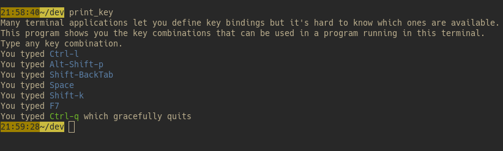

[![Latest Version][s1]][l1] [![Chat on Miaou][s2]][l2]

[s1]: https://img.shields.io/crates/v/print_key.svg
[l1]: https://crates.io/crates/print_key

[s2]: https://miaou.dystroy.org/static/shields/room.svg
[l2]: https://miaou.dystroy.org/3768?rust

Your OS and your terminal intercept many key combinations, and hide the modifiers of some.
This makes defining keybindings for terminal applications often challenging.

**print_key** helps you determine the available key combinations for terminal applications, and how those terminal applications receive them.

Key combinations are printed the way they can be written in key binding configurations of programs such as [broot](https://dystroy.org/broot) or [bacon](https://dystroy.org/bacon).

This serialized format can be parsed by the [crokey](https://github.com/Canop/crokey) Rust library.

Precompiled binaries are available at [https://dystroy.org/print_key/download](https://dystroy.org/print_key/download).
